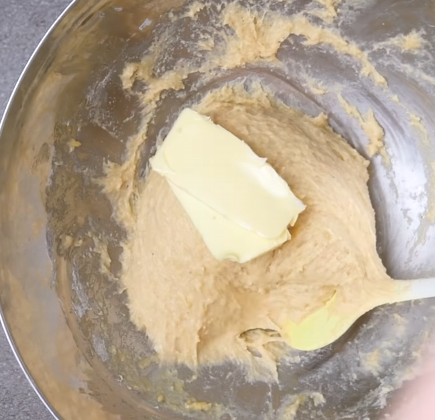
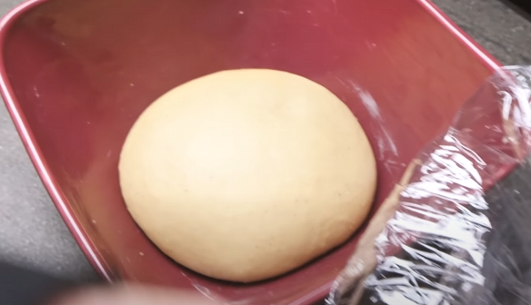
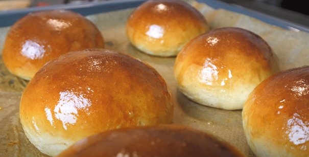

# Brioche Bun zum Verlieben
## _The Best_

Achtung, dies ist ein sehr gutes Rezept, achten Sie auf Ihre Form! :D

- ✨ Rezept
- ✨ Teilschritte
- ✨  Geniessen

# Rezept

Menge | Zutat
------ | ------
| 140 ml | Milch |
320 g | Mehl (Weizen, Allzweck)
45 g | Zucker
5 g | Vanille Zucker
1 | Ei
1 | Eigelb
50 g | Butter
9 g | Salz
20 g | Hefe

# Teilschritte

1. Milch auf Raumtemperatur erwärmen und Hefe beigeben. 10 Minuten ziehen lassen, bis die Hefe aufgelöst ist.

2. Mehl in grosse Schüssel sieben, Vanillezucker, Zucker und Salz zugeben. Vermischen.

3. Wenn die Hefe in der Milch aufgelöst ist, Milch der Mehlmischung hinzufügen.

4. Kräftig rühren, das Ei und Eigelb beigeben und kräftig rühren. Achtung, wird klebrig! Noch kein Mehl beigeben.

5. Wenn es zu einem homogenen Teig verührt ist, die Butter nach und nach einkneten/einmischen

6. 10 Minuten so weiterrühren, bis er nicht mehr so an der Schüssel klebt.

7. Teig auf einer Arbeitsfläche verteilen und zu einer Kugel formen. Falls er hier noch immer sehr klebt, etwas Mehl beifügen.

8. Teig in eine eingebutterte Schüssel/Form reinlegen und mit Klarsichtfolie abdecken

9. Teig 80-90 Minuten gehen lassen. Der Teig muss sich in der Grösse verdoppelt haben.

10. Arbeitsfläche bemehlen und Teig darauf stürzen. Einzelne Teiglinge mit je 100g auf der Waage abwägen.  

11. Teigliche formen, 1-minütiges Youtube Video ==> [Teiglinge Formen - Youtube Video](https://youtube.com/clip/Ugkxv345aRwULGtr0Pm_8XibHyatZ_IKeOFH)
GANZ WICHTIG, DIE TEIGLINGE SOLLEN RUND UND SCHÖN GESTRAFT SEIN!! :DDD

12. Auf dem Blech genügend Abstand zwischen den Buns lassen. Blech mit Teigliche erneut mit Folie abdecken und weitere 80-90 Minuten gehen lassen

13. Ei-Milchmischung zum Bestreichen benutzen und die Buns einpinseln.

14. Buns ca. 14-15 Minuten bei 190° Ober- und Unterhitze backen bis sie schön goldbraun sind.
 
15. Direkt nach dem Rausnehmen mit zerlassener Butter die fertigen Buns bestreichen, weniger ist mehr. ;-D

